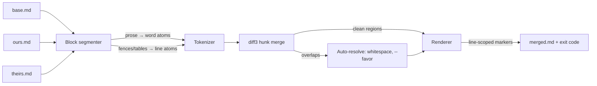

# prosemend

[English](README.md) | [中文](README.zh.md) | [日本語](README.ja.md)

[](LICENSE) [](CHANGELOG.md) [](pyproject.toml)  [](CONTRIBUTING.md)

**prosemend：Markdown 散文のための単語レベル三方向マージ、オープンソース —— 偽の競合を diff3 や git より劇的に減らす。**


```bash
git clone https://github.com/JaydenCJ/prosemend && cd prosemend && pip install -e .
```

> **プレリリース：** prosemend はまだ PyPI に公開されていません。最初のリリースまでは [JaydenCJ/prosemend](https://github.com/JaydenCJ/prosemend) をクローンし、リポジトリのルートで `pip install -e .` を実行してください。ランタイム依存はゼロ —— 標準ライブラリだけで動きます。

## なぜ prosemend？

行ベースのマージツールはどれも、散文をコードのように扱います。しかし書き手は行単位では編集しません：変えるのは文中の一語であり、Markdown の慣習（そしてあらゆる Obsidian ノート）は段落全体を一行に収めます。そのため二人が git や Syncthing でノートを同期し、同じ段落に触れると —— 一人は冒頭の誤字を直し、もう一人は末尾を書き直しただけで —— `diff3` と `git merge` は「同じ行」への二つの編集と見なして競合を宣告します。編集箇所は何語も離れているのに、です。docs-as-code のチームや Obsidian-git のユーザーは、こうした本来競合ではない競合を毎週手作業で解消しています。prosemend は書き手が実際に編集する粒度でマージします：三つのバージョンを単語単位で整列させ（マージ原子は Markdown を認識し、リンクやインラインコードは決して引き裂かれません）、重ならない両者の編集を適用し、二人が本当に同じ語群を書き換えたときだけ競合を報告します。コードフェンス、テーブル、front matter の内部では意図的に行マージへ退避します —— コードを単語単位で並べ直すのは競合より悪いからです。結果は git の merge driver としてそのまま組み込め、`git merge` も `git rebase` も `git stash pop` も一晩で静かになります。

|  | prosemend | git merge-file / diff3 | wiggle | Mergiraf |
|---|---|---|---|---|
| 散文のマージ単位 | 単語・文・行 | 行のみ | 単語 | 構文木ノード |
| 同一行への一語編集×2 | クリーンにマージ | 競合 | クリーンにマージ | コード専用、散文モデルなし |
| Markdown 構造の尊重 | フェンス/テーブル/front matter は行マージ維持；リンクとインラインコードは原子 | 構造モデルなし | なし —— コードも単語マージされる | コード文法のみ、Markdown 散文は対象外 |
| CJK の散文 | 文字レベルの原子、分かち書き器不要 | 行レベル | バイト列であり文字体系を知らない | 対象外 |
| 競合の出力 | git 形式マーカー、行全体に拡張 | git 形式マーカー | 既定は `<<<---` の単語マーカー | git 形式マーカー |
| ランタイム依存 | 0（Python 標準ライブラリ） | git/diffutils に同梱 | C バイナリ | Rust バイナリ |

<sub>比較は各上流ドキュメントに基づく（2026-07 時点）。wiggle は単語レベルのパッチ復旧に優れますが、*すべての*行に同じ単語マージを適用します —— コードも含めて。prosemend はコードでは意図的に行レベルを守ります。prosemend の依存数は [pyproject.toml](pyproject.toml) の `dependencies = []` です。</sub>

## 特徴

- **単語レベルの三方向マージ** —— 古典的な diff3 の hunk アルゴリズムを、行ではなく単語原子の上で実行。同一行内の重ならない編集は競合ではなくクリーンにマージ。
- **Markdown を認識する原子** —— インラインコード・リンク・画像・オートリンクは不可分；コードフェンス・パイプテーブル・字下げコード・YAML front matter は常に行単位でマージ；空行が段落のアンカーになり、無関係な編集は決して絡まない。
- **正直な競合、読める出力** —— 本当の二重編集は今も競合する；マーカーは行全体へ広げられ行ごとに統合されるため、出力は git・エディタ・`grep '<<<<<<<'` がそのまま理解できる形式。
- **そのまま使える git merge driver** —— `prosemend driver %O %A %B` は git の merge-driver 契約に従う（`%A` をその場で書き換え、終了コード 0/1、`--marker-size` が `%L` に対応）；設定二行で `.md` のマージがすべて単語レベルに。
- **三つの粒度と三つのポリシー** —— `--granularity word|sentence|line` で厳しさを調整；`--favor ours|theirs|union` は `git merge-file` の解決フラグに対応；空白だけの相違は自動解消。
- **CJK ネイティブ** —— 中国語・日本語の散文は文字粒度でマージされ、`。！？` は後続の空白なしで文を終端。

## クイックスタート

インストール：

```bash
git clone https://github.com/JaydenCJ/prosemend && cd prosemend && pip install -e .
```

二人が同じ行の別々の単語を編集しました：

```bash
printf 'The quick brown fox jumps over the lazy dog.\n' > base.md
printf 'The swift brown fox jumps over the lazy dog.\n' > ours.md
printf 'The quick brown fox leaps over the lazy dog.\n' > theirs.md

git merge-file -p ours.md base.md theirs.md   # what git does today
prosemend merge ours.md base.md theirs.md     # what prosemend does
```

実際に採取した出力 —— git は競合し、prosemend は両方の編集を残します：

```text
$ git merge-file -p ours.md base.md theirs.md
<<<<<<< ours.md
The swift brown fox jumps over the lazy dog.
=======
The quick brown fox leaps over the lazy dog.
>>>>>>> theirs.md
$ prosemend merge ours.md base.md theirs.md
The swift brown fox leaps over the lazy dog.
```

双方が本当に同じ単語を書き換えたときは、正直な、行単位に区切られた競合と終了コード 1 が返ります（実際に採取した出力）：

```text
$ prosemend merge ours.md base.md rewritten.md
<<<<<<< ours.md
The swift brown fox jumps over the lazy dog.
=======
The rapid brown fox jumps over the lazy dog.
>>>>>>> rewritten.md
prosemend: 1 conflict
```

より大きな実行可能トリオ —— front matter・散文・テーブル・コードフェンスが同時に編集されたもの —— は [`examples/`](examples/) に、マージパイプラインの仕様は [`docs/merge-strategy.md`](docs/merge-strategy.md) にあります。

## git merge driver として使う

設定二行で、リポジトリ内のすべての Markdown マージが単語レベルになります：

```bash
git config merge.prosemend.name "word-level Markdown merge"
git config merge.prosemend.driver "prosemend driver %O %A %B --marker-size %L"
echo "*.md merge=prosemend" >> .gitattributes
```

Syncthing・Dropbox・Nextcloud のユーザーは同じマージを手動で実行できます：`prosemend merge` に競合コピー、共通祖先（スナップショットやバックアップ由来など）、現在のファイルを渡すだけです。

## CLI リファレンス

| コマンド | 動作 | 終了コード |
|---|---|---|
| `prosemend merge OURS BASE THEIRS` | stdout または `-o FILE` へマージ（diff3 の引数順） | 0 クリーン · 1 競合 · 2 エラー |
| `prosemend driver BASE OURS THEIRS` | git merge-driver モード：OURS をその場で書き換え | 0 クリーン · 1 競合 · 2 エラー |
| `prosemend diff OLD NEW` | wdiff 記法の単語レベル diff | 0 同一 · 1 差分あり · 2 エラー |

| キー | 既定値 | 効果 |
|---|---|---|
| `--granularity` | `word` | 散文のマージ原子：`word`・`sentence`・`line`（古典的 diff3） |
| `--favor` | `none` | 残る競合の自動解決：`ours`・`theirs`・`union` |
| `--style` | `git` | 競合マーカー；`diff3` は `\|\|\|\|\|\|\|` の base 区間を追加 |
| `-L, --label` | ファイルパス | ours/base/theirs の競合ラベル（最大三回繰り返し） |
| `--marker-size` | `7` | マーカーの長さ；git の `%L` をここに接続 |
| `-o, --output` | stdout | マージ結果をファイルへ書き出し |

同じエンジンはライブラリとしても使えます：`from prosemend import merge_text, merge_files, word_diff, MergeOptions`。

## 検証

このリポジトリは CI を一切同梱しません；上記の主張はすべてローカル実行で検証されています。このリポジトリのチェックアウトから再現できます：

```bash
pip install -e '.[dev]' && pytest && bash scripts/smoke.sh
```

出力（実際の実行からコピー、`...` で省略）：

```text
92 passed in 0.69s
...
[smoke] word-level merge: clean, all four edits kept
[smoke] line granularity: 1 false conflict, as diff3 would
SMOKE OK
```

## アーキテクチャ



## ロードマップ

- [x] 単語レベル diff3 エンジン、Markdown 認識原子、文/行粒度、favor ポリシー、git merge driver、wdiff 形式 diff、CLI（v0.1.0）
- [ ] PyPI 公開、`pip install prosemend` 対応
- [ ] セクション移動の検出：移動した見出しを削除＋追加ではなく「移動」としてマージ
- [ ] Syncthing/Nextcloud の競合コピー向け `prosemend resolve`：`.sync-conflict` 名からトリオを自動特定
- [ ] 任意の stdin 入力（`-`）とエディタ統合向け `--report json`

完全なリストは [open issues](https://github.com/JaydenCJ/prosemend/issues) を参照してください。

## コントリビュート

コントリビュート歓迎です —— まずは [good first issue](https://github.com/JaydenCJ/prosemend/issues?q=is%3Aissue+is%3Aopen+label%3A%22good+first+issue%22) から、あるいは [discussion](https://github.com/JaydenCJ/prosemend/discussions) を立ててください。開発環境の構築は [CONTRIBUTING.md](CONTRIBUTING.md) を参照。

## ライセンス

[MIT](LICENSE)
