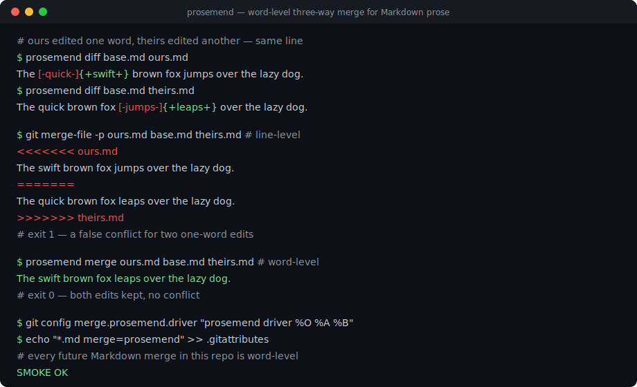
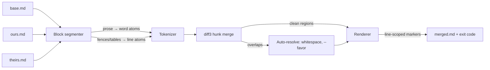

# prosemend

[English](README.md) | [中文](README.zh.md) | [日本語](README.ja.md)

[](LICENSE) [](CHANGELOG.md) [](pyproject.toml)  [](CONTRIBUTING.md)

**prosemend：an open-source word-level three-way merge for Markdown prose — drastically fewer false conflicts than diff3 and git.**



```bash
git clone https://github.com/JaydenCJ/prosemend && cd prosemend && pip install -e .
```

> **Pre-release:** prosemend is not yet published to PyPI. Until the first release, clone [JaydenCJ/prosemend](https://github.com/JaydenCJ/prosemend) and run `pip install -e .` from the repository root. Zero runtime dependencies — the standard library is all it needs.

## Why prosemend?

Every line-based merge tool treats prose as if it were code. Writers do not edit in lines: they change one word of a sentence, and Markdown convention (and every Obsidian note) puts a whole paragraph on one line. So when two people sync notes through git or Syncthing and both touch the same paragraph — one fixes a typo at the start, the other rewords the end — `diff3` and `git merge` see two edits to "the same line" and declare a conflict, even though the edits are words apart. Docs-as-code teams and Obsidian-git users resolve these non-conflicts by hand every week. prosemend merges at the granularity writers actually edit at: it aligns the three versions word-by-word (with Markdown-aware atoms, so links and code spans are never torn apart), applies both sides' non-overlapping edits, and only conflicts when two hands genuinely rewrote the same words. Inside code fences, tables, and front matter it deliberately falls back to line merging — reflowing code word-by-word would be worse than a conflict. The result plugs straight into git as a merge driver, so `git merge`, `git rebase`, and `git stash pop` all get quieter overnight.

|  | prosemend | git merge-file / diff3 | wiggle | Mergiraf |
|---|---|---|---|---|
| Merge unit for prose | words, sentences, or lines | lines only | words | syntax-tree nodes |
| Two one-word edits on one line | merges cleanly | conflict | merges cleanly | code only, no prose model |
| Markdown structure respected | fences/tables/front matter stay line-merged; links and code spans atomic | no structure model | none — code merges word-wise too | code grammars, not Markdown prose |
| CJK prose | character-level atoms, no segmenter needed | line-level | byte runs, not scripts | n/a |
| Conflict output | git-style markers, widened to whole lines | git-style markers | `<<<---` word markers by default | git-style markers |
| Runtime dependencies | 0 (Python stdlib) | ships with git/diffutils | C binary | Rust binary |

<sub>Comparison reflects upstream documentation as of 2026-07. wiggle is excellent at word-level patch recovery, but it applies the same word merging to *every* line — including code, where prosemend deliberately stays line-based. prosemend's dependency count is `dependencies = []` in [pyproject.toml](pyproject.toml).</sub>

## Features

- **Word-level three-way merge** — the classic diff3 hunk algorithm, run over word atoms instead of lines, so non-overlapping edits to the same line merge cleanly instead of conflicting.
- **Markdown-aware atoms** — inline code spans, links, images, and autolinks are indivisible; code fences, pipe tables, indented code, and YAML front matter always merge line-wise; blank lines anchor paragraphs so unrelated edits never entangle.
- **Honest conflicts, readable output** — real double edits still conflict; markers are widened to whole lines and coalesced per line, so the output is exactly what git, editors, and `grep '<<<<<<<'` already understand.
- **Drop-in git merge driver** — `prosemend driver %O %A %B` follows git's merge-driver contract (rewrites `%A`, exit 0/1, `--marker-size` for `%L`); two config lines make every `.md` merge word-level.
- **Three granularities and three policies** — `--granularity word|sentence|line` tunes strictness; `--favor ours|theirs|union` mirrors `git merge-file`'s resolution flags; whitespace-only divergence is auto-resolved.
- **CJK-native** — Chinese and Japanese prose merges at character granularity, and `。！？` end sentences without needing a following space.

## Quickstart

Install:

```bash
git clone https://github.com/JaydenCJ/prosemend && cd prosemend && pip install -e .
```

Two people edit different words of the same line:

```bash
printf 'The quick brown fox jumps over the lazy dog.\n' > base.md
printf 'The swift brown fox jumps over the lazy dog.\n' > ours.md
printf 'The quick brown fox leaps over the lazy dog.\n' > theirs.md

git merge-file -p ours.md base.md theirs.md   # what git does today
prosemend merge ours.md base.md theirs.md     # what prosemend does
```

Real captured output — git conflicts, prosemend keeps both edits:

```text
$ git merge-file -p ours.md base.md theirs.md
<<<<<<< ours.md
The swift brown fox jumps over the lazy dog.
=======
The quick brown fox leaps over the lazy dog.
>>>>>>> theirs.md
$ prosemend merge ours.md base.md theirs.md
The swift brown fox leaps over the lazy dog.
```

When both sides really do rewrite the same word, you get an honest, line-scoped conflict and exit code 1 (real captured output):

```text
$ prosemend merge ours.md base.md rewritten.md
<<<<<<< ours.md
The swift brown fox jumps over the lazy dog.
=======
The rapid brown fox jumps over the lazy dog.
>>>>>>> rewritten.md
prosemend: 1 conflict
```

A larger runnable trio — front matter, prose, a table, and a code fence, all edited concurrently — lives in [`examples/`](examples/), and the merge pipeline is specified in [`docs/merge-strategy.md`](docs/merge-strategy.md).

## Use as a git merge driver

Two lines of config, and every Markdown merge in the repository becomes word-level:

```bash
git config merge.prosemend.name "word-level Markdown merge"
git config merge.prosemend.driver "prosemend driver %O %A %B --marker-size %L"
echo "*.md merge=prosemend" >> .gitattributes
```

Syncthing, Dropbox, and Nextcloud users get the same merge manually: point `prosemend merge` at the conflict copy, a common ancestor (e.g. from a snapshot or backup), and the current file.

## CLI reference

| Command | Does | Exit codes |
|---|---|---|
| `prosemend merge OURS BASE THEIRS` | merge to stdout or `-o FILE` (diff3 argument order) | 0 clean · 1 conflicts · 2 error |
| `prosemend driver BASE OURS THEIRS` | git merge-driver mode: rewrites OURS in place | 0 clean · 1 conflicts · 2 error |
| `prosemend diff OLD NEW` | word-level diff in wdiff notation | 0 identical · 1 differs · 2 error |

| Key | Default | Effect |
|---|---|---|
| `--granularity` | `word` | prose merge atom: `word`, `sentence`, or `line` (classic diff3) |
| `--favor` | `none` | auto-resolve remaining conflicts: `ours`, `theirs`, or `union` |
| `--style` | `git` | conflict markers; `diff3` adds the `\|\|\|\|\|\|\|` base section |
| `-L, --label` | file paths | conflict labels for ours/base/theirs (repeat up to three times) |
| `--marker-size` | `7` | marker run length; wire git's `%L` to it |
| `-o, --output` | stdout | write the merge result to a file |

The same engine is available as a library: `from prosemend import merge_text, merge_files, word_diff, MergeOptions`.

## Verification

This repository ships no CI; every claim above is verified by local runs. Reproduce them from a checkout of this repository:

```bash
pip install -e '.[dev]' && pytest && bash scripts/smoke.sh
```

Output (copied from a real run, truncated with `...`):

```text
92 passed in 0.69s
...
[smoke] word-level merge: clean, all four edits kept
[smoke] line granularity: 1 false conflict, as diff3 would
SMOKE OK
```

## Architecture



## Roadmap

- [x] Word-level diff3 engine, Markdown-aware atoms, sentence/line granularities, favor policies, git merge driver, wdiff-style diff, CLI (v0.1.0)
- [ ] PyPI release with `pip install prosemend`
- [ ] Section-move detection, so a relocated heading merges as a move instead of delete-plus-add
- [ ] `prosemend resolve` for Syncthing/Nextcloud conflict copies: find the trio automatically from `.sync-conflict` names
- [ ] Optional stdin input (`-`) and `--report json` for editor integrations

See the [open issues](https://github.com/JaydenCJ/prosemend/issues) for the full list.

## Contributing

Contributions are welcome — start with a [good first issue](https://github.com/JaydenCJ/prosemend/issues?q=is%3Aissue+is%3Aopen+label%3A%22good+first+issue%22) or open a [discussion](https://github.com/JaydenCJ/prosemend/discussions). See [CONTRIBUTING.md](CONTRIBUTING.md) for the development setup.

## License

[MIT](LICENSE)
