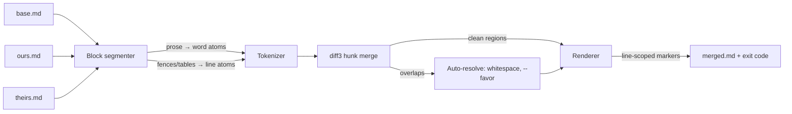

# prosemend

[English](README.md) | [中文](README.zh.md) | [日本語](README.ja.md)

[](LICENSE) [](CHANGELOG.md) [](pyproject.toml)  [](CONTRIBUTING.md)

**prosemend：开源的 Markdown 散文词级三方合并工具 —— 假冲突远少于 diff3 和 git。**


```bash
git clone https://github.com/JaydenCJ/prosemend && cd prosemend && pip install -e .
```

> **预发布：** prosemend 尚未发布到 PyPI。在首个正式版之前，请克隆 [JaydenCJ/prosemend](https://github.com/JaydenCJ/prosemend) 并在仓库根目录运行 `pip install -e .`。零运行时依赖 —— 只需要标准库。

## 为什么选 prosemend？

所有基于行的合并工具都把散文当代码处理。但写作者并不按行编辑：他们改的是句子里的一个词，而 Markdown 惯例（以及每一篇 Obsidian 笔记）会把整个段落放在同一行上。于是当两个人通过 git 或 Syncthing 同步笔记、又都碰了同一段落时 —— 一个改了开头的错别字，另一个润色了结尾 —— `diff3` 和 `git merge` 看到的是"同一行"的两处编辑，直接宣告冲突，尽管两处编辑相隔十几个词。docs-as-code 团队和 Obsidian-git 用户每周都在手工解决这些本不是冲突的冲突。prosemend 按写作者真正的编辑粒度进行合并：把三个版本逐词对齐（合并原子是 Markdown 感知的，链接和行内代码永远不会被撕开），应用双方互不重叠的编辑，只有当两只手真的改写了同一批词时才报冲突。在代码围栏、表格和 front matter 内部，它刻意回退到按行合并 —— 把代码逐词重排比冲突更糟。合并结果可以直接作为 git merge driver 接入，`git merge`、`git rebase`、`git stash pop` 一夜之间都安静下来。

|  | prosemend | git merge-file / diff3 | wiggle | Mergiraf |
|---|---|---|---|---|
| 散文的合并单位 | 词、句或行 | 仅行 | 词 | 语法树节点 |
| 同一行上的两处单词编辑 | 干净合并 | 冲突 | 干净合并 | 仅限代码，没有散文模型 |
| 尊重 Markdown 结构 | 围栏/表格/front matter 保持按行合并；链接与行内代码为原子 | 没有结构模型 | 没有 —— 代码也被逐词合并 | 只有代码语法，不懂 Markdown 散文 |
| CJK 散文 | 字符级原子，无需分词器 | 行级 | 字节串，不识别文字 | 不适用 |
| 冲突输出 | git 风格标记，扩展到整行 | git 风格标记 | 默认是 `<<<---` 词级标记 | git 风格标记 |
| 运行时依赖 | 0（Python 标准库） | 随 git/diffutils 附带 | C 二进制 | Rust 二进制 |

<sub>对比基于各上游文档，截至 2026-07。wiggle 在词级补丁恢复上非常出色，但它对*每一*行都做同样的词级合并 —— 包括代码，而 prosemend 在代码处刻意保持行级。prosemend 的依赖数即 [pyproject.toml](pyproject.toml) 中的 `dependencies = []`。</sub>

## 特性

- **词级三方合并** —— 经典 diff3 hunk 算法，但跑在词原子而非行上，同一行内互不重叠的编辑得以干净合并，而不是冲突。
- **Markdown 感知的原子** —— 行内代码、链接、图片和自动链接不可分割；代码围栏、管道表格、缩进代码和 YAML front matter 永远按行合并；空行充当段落锚点，无关编辑绝不纠缠。
- **诚实的冲突、可读的输出** —— 真正的双重编辑仍会冲突；标记扩展到整行并按行合并，输出正是 git、编辑器和 `grep '<<<<<<<'` 已经能理解的格式。
- **即插即用的 git merge driver** —— `prosemend driver %O %A %B` 遵循 git 的 merge-driver 契约（原地重写 `%A`、退出码 0/1、`--marker-size` 对接 `%L`）；两行配置就能让所有 `.md` 合并变成词级。
- **三种粒度、三种策略** —— `--granularity word|sentence|line` 调节严格程度；`--favor ours|theirs|union` 对应 `git merge-file` 的解决标志；纯空白差异自动消解。
- **CJK 原生支持** —— 中文和日文散文按字符粒度合并，`。！？` 结束句子时无需后随空格。

## 快速上手

安装：

```bash
git clone https://github.com/JaydenCJ/prosemend && cd prosemend && pip install -e .
```

两个人编辑了同一行的不同单词：

```bash
printf 'The quick brown fox jumps over the lazy dog.\n' > base.md
printf 'The swift brown fox jumps over the lazy dog.\n' > ours.md
printf 'The quick brown fox leaps over the lazy dog.\n' > theirs.md

git merge-file -p ours.md base.md theirs.md   # what git does today
prosemend merge ours.md base.md theirs.md     # what prosemend does
```

真实采集的输出 —— git 报冲突，prosemend 保留双方编辑：

```text
$ git merge-file -p ours.md base.md theirs.md
<<<<<<< ours.md
The swift brown fox jumps over the lazy dog.
=======
The quick brown fox leaps over the lazy dog.
>>>>>>> theirs.md
$ prosemend merge ours.md base.md theirs.md
The swift brown fox leaps over the lazy dog.
```

当双方确实改写了同一个词时，你会得到一个诚实的、按行圈定的冲突和退出码 1（真实采集的输出）：

```text
$ prosemend merge ours.md base.md rewritten.md
<<<<<<< ours.md
The swift brown fox jumps over the lazy dog.
=======
The rapid brown fox jumps over the lazy dog.
>>>>>>> rewritten.md
prosemend: 1 conflict
```

一个更大的可运行三元组 —— front matter、散文、表格和代码围栏被同时编辑 —— 位于 [`examples/`](examples/)，合并管线的规格见 [`docs/merge-strategy.md`](docs/merge-strategy.md)。

## 用作 git merge driver

两行配置，仓库里的每次 Markdown 合并都变成词级：

```bash
git config merge.prosemend.name "word-level Markdown merge"
git config merge.prosemend.driver "prosemend driver %O %A %B --marker-size %L"
echo "*.md merge=prosemend" >> .gitattributes
```

Syncthing、Dropbox 和 Nextcloud 用户可以手动做同样的合并：把 `prosemend merge` 指向冲突副本、一个共同祖先（例如来自快照或备份）和当前文件。

## CLI 参考

| 命令 | 作用 | 退出码 |
|---|---|---|
| `prosemend merge OURS BASE THEIRS` | 合并到 stdout 或 `-o FILE`（diff3 参数顺序） | 0 干净 · 1 冲突 · 2 错误 |
| `prosemend driver BASE OURS THEIRS` | git merge-driver 模式：原地重写 OURS | 0 干净 · 1 冲突 · 2 错误 |
| `prosemend diff OLD NEW` | wdiff 记法的词级 diff | 0 相同 · 1 有差异 · 2 错误 |

| 键 | 默认值 | 效果 |
|---|---|---|
| `--granularity` | `word` | 散文合并原子：`word`、`sentence` 或 `line`（经典 diff3） |
| `--favor` | `none` | 自动解决剩余冲突：`ours`、`theirs` 或 `union` |
| `--style` | `git` | 冲突标记；`diff3` 会加上 `\|\|\|\|\|\|\|` base 段 |
| `-L, --label` | 文件路径 | ours/base/theirs 的冲突标签（最多重复三次） |
| `--marker-size` | `7` | 标记串长度；把 git 的 `%L` 接到这里 |
| `-o, --output` | stdout | 把合并结果写入文件 |

同一引擎也可作为库使用：`from prosemend import merge_text, merge_files, word_diff, MergeOptions`。

## 验证

本仓库不带任何 CI；上面的每一条声明都由本地运行验证。从本仓库的检出即可复现：

```bash
pip install -e '.[dev]' && pytest && bash scripts/smoke.sh
```

输出（复制自真实运行，用 `...` 截断）：

```text
92 passed in 0.69s
...
[smoke] word-level merge: clean, all four edits kept
[smoke] line granularity: 1 false conflict, as diff3 would
SMOKE OK
```

## 架构



## 路线图

- [x] 词级 diff3 引擎、Markdown 感知原子、句/行粒度、favor 策略、git merge driver、wdiff 风格 diff、CLI（v0.1.0）
- [ ] 发布到 PyPI，支持 `pip install prosemend`
- [ ] 章节移动检测：被挪走的标题按"移动"合并，而不是删除加新增
- [ ] `prosemend resolve` 处理 Syncthing/Nextcloud 冲突副本：从 `.sync-conflict` 文件名自动找齐三元组
- [ ] 可选的 stdin 输入（`-`）和面向编辑器集成的 `--report json`

完整列表见 [open issues](https://github.com/JaydenCJ/prosemend/issues)。

## 贡献

欢迎贡献 —— 从一个 [good first issue](https://github.com/JaydenCJ/prosemend/issues?q=is%3Aissue+is%3Aopen+label%3A%22good+first+issue%22) 开始，或发起一个 [discussion](https://github.com/JaydenCJ/prosemend/discussions)。开发环境搭建见 [CONTRIBUTING.md](CONTRIBUTING.md)。

## 许可证

[MIT](LICENSE)
